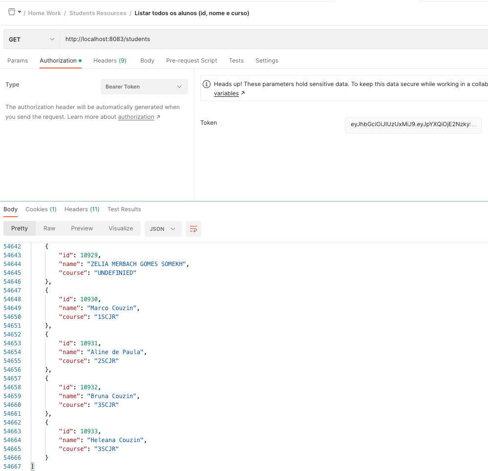
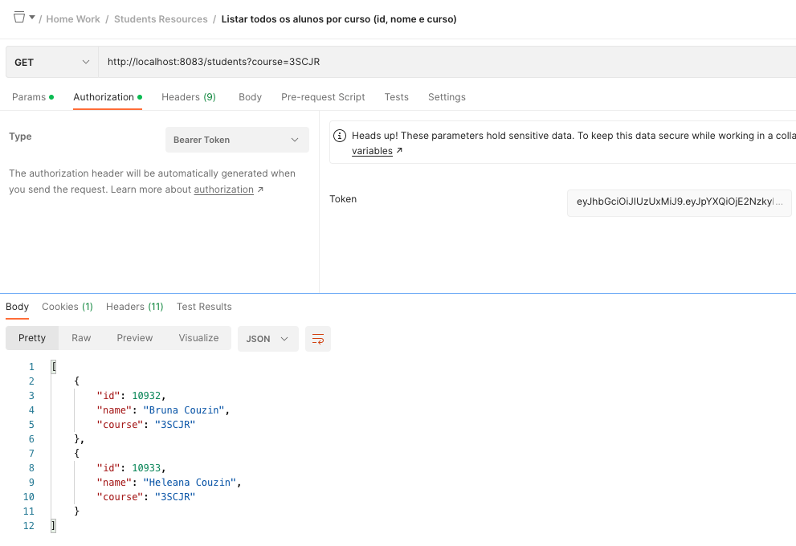
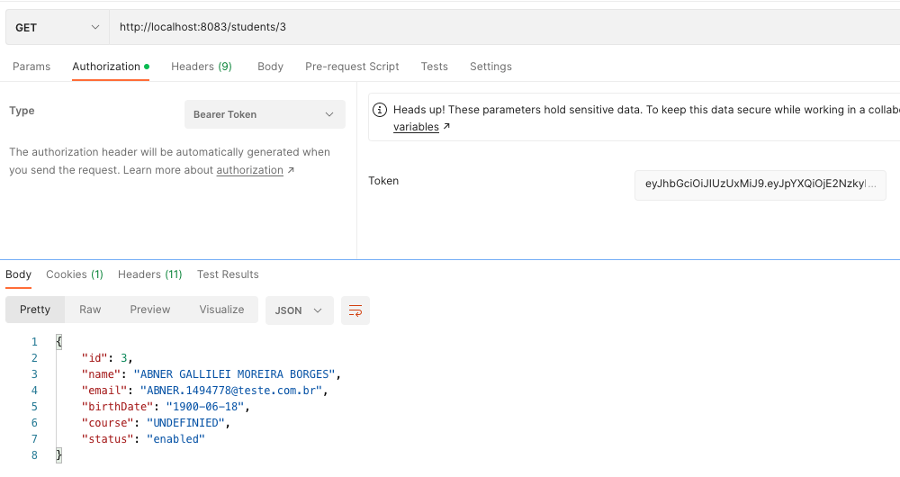
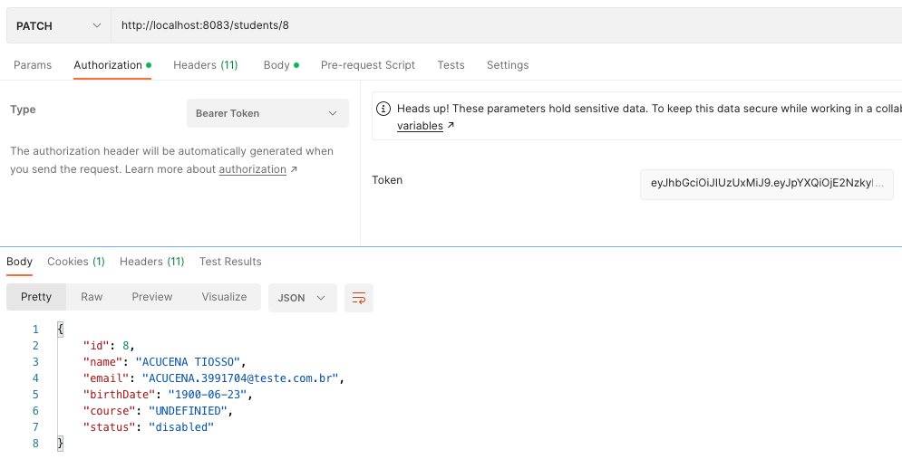
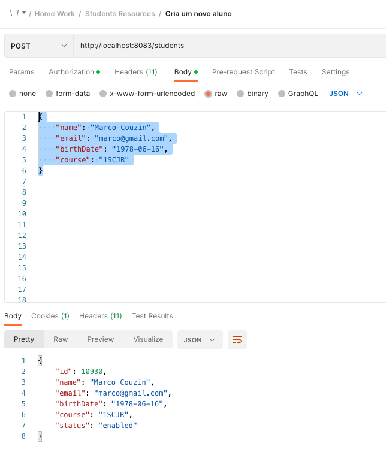
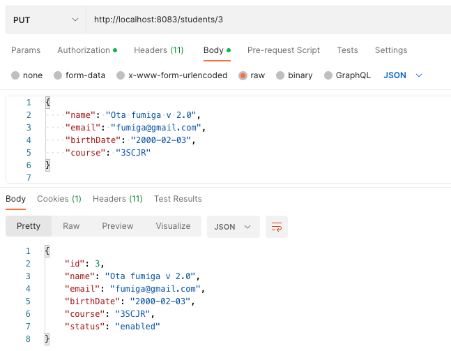
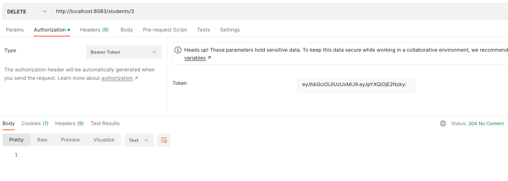
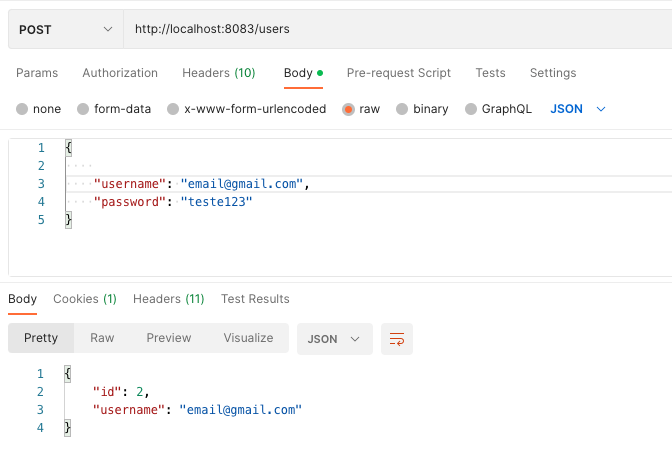
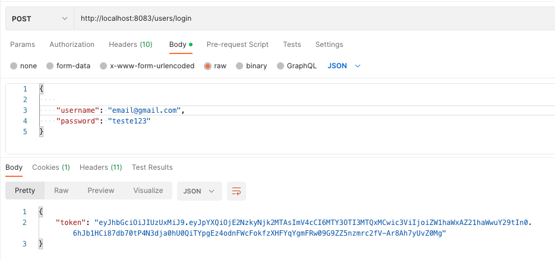

# DISCIPLINA SPRING
Trabalho final da disciplina Spring

## ACQUIRER MODULE
Este módulo tem o objetivo de cadastrar, alterar, consultar e excluir alunos.

Aqui, também, estão disponíveis as funcionalidades de autenticar os usuários, bem como permitir a 
geração do JWT para acessos as demais funcionalidades.

### Os endpoints para gestão dos alunos são:
1. Listar todos os alunos (id, nome e curso);

    GET /students

2. Listar todos os alunos por curso (id, nome e curso);
    
    GET /students?course=3SCJR

3. Consulta aluno por ID (Mostra todos os campos);

    GET /students/3

4. Atualiza o status do aluno;

    PATCH /students/8

5. Cria um novo aluno;

    POST /students

6. Atualiza os dados do aluno (menos id e status);

    PUT /students/3

7. Apaga aluno por id.

    DELETE /students/3

### Os endpoints relacionados a segurança são:
1. Criar usuário para acesso às APIs;

    POST /users/login

2. Autentica o usuário e gera o JWT.

   POST /users

## INSTRUÇÕES
1. Este módulo deve ser o primeiro a ser executado para que crie as bases de autenticação;
2. A base de dados e suas credenciais estão disponíveis no arquivo "application.yaml";
3. Apenas os endpoints de segurança estão abertos. Os demais necessidatam do JWT para funcionarem;
4. O JWT deve sempre ser passado como "Authorization", no parâmetro "Bearer Token".

## NOTAS:
###### Em função das limitações de utilização do banco de dados H2, os projetos devem ser executados individualmente.
